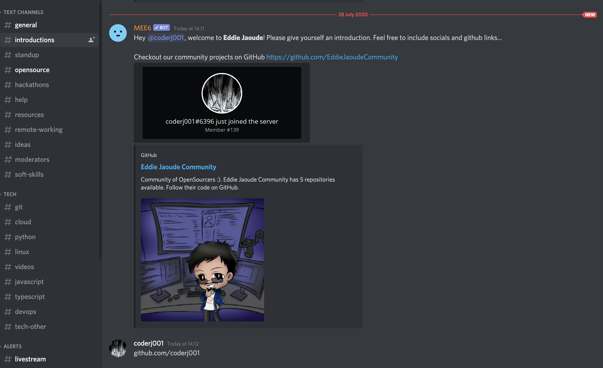

# Shortlink Generator (without OpenGraph embed)
This would be a shortlink generator that prevents Slack/Discord/Teams/whatever.

## What does this solve?
tl;dr This will be a shortlink generator that checks the User Agent (or other way of fingerprinting that the request is from Teams/Skype e.g. from Microsoft's IPs - more details in the issue queue) and prevents the HTTP 301/302 redirect so that it won't show up as a link.

This solves the very annoying (and very privacy invasive) practice of being able to put a URL in a chat and you don't *really* need it to show the links metadata.

The way this would work would be either proxy the sites title (using curl, not any heavy web proxying) so it actually doesn't just purposefully fail.

An example annoying use of this is here, MEE6 bot unnecessarily resolves the URL after putting quite a noisy PNG in the chat as well, it makes the introductions channel way too messy.

## What does it need?
  - A Simple UI to create a short link
  - A way to deploy to a host which offers free invocations (e.g. Cloudflare Edge CDN, Lambda, Azure's offerings, Vercel or just use Serverless to allow multiple backends) without much effort think:-
    - a CloudFormation/Vercel/Azure template
    - Docker image or whatever that can be deployed to say DigitalOcean/Linode as a container?

## Technical considerations
This will go in the issue queue.